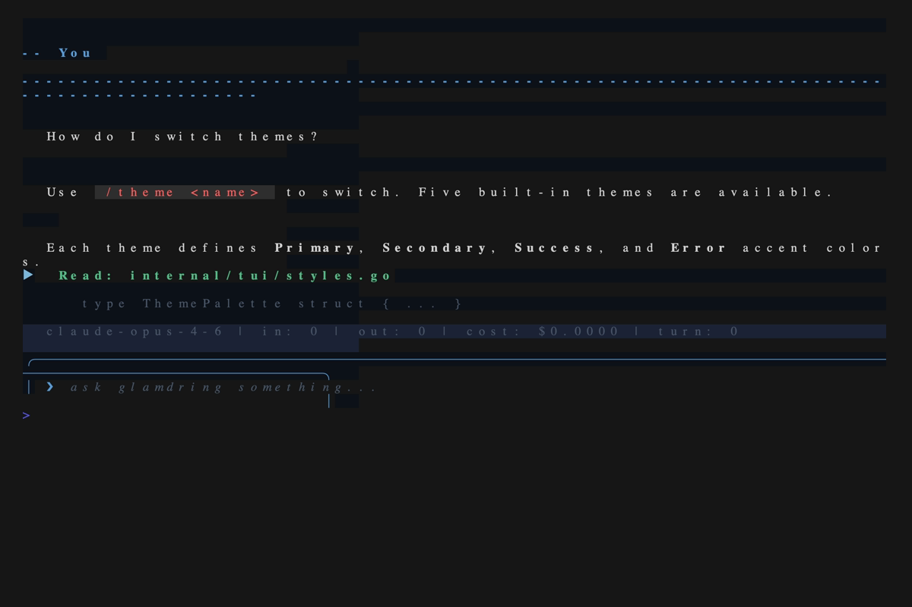

# glamdring

A fast, native TUI for agentic coding with Claude. Built in Go with [Charm](https://charm.sh) libraries, replacing Claude Code's Ink-based frontend with a lightweight, responsive alternative.



**Documentation:** [glamdring docs](https://justinjdev.github.io/glamdring/)

## Features

- **Agentic loop** — streaming responses, multi-turn conversations with persistent session memory, extended thinking with `/thinking` toggle, prompt caching support
- **Agent interrupt** — `Ctrl+C` cancels the current turn instead of killing the program; double-press to quit
- **Thinking spinner** — visual feedback while the agent is processing
- **Per-model cost tracking** — accurate pricing for Opus, Sonnet, and Haiku
- **Context window display** — live `ctx: N%` in status bar with color thresholds (gold at 60%, red at 80%) and inline `/compact` suggestions
- **Built-in tools** — Read (2000-line default limit, line truncation), Write (read-before-write safety), Edit (permission-preserving, no-op rejection), Bash (timeout detection, 1MB output limit, background execution, real-time output streaming), Glob (noise directory filtering, result limits), Grep (full ripgrep-style flags, binary detection, type filters) + [shire](https://github.com/justinjdev/shire) index tools (auto-detected, auto-rebuilt after file changes)
- **Permission system** — three-tier model (always-allow, prompt, block) with session-level overrides, yolo mode, and configurable path/command-scoped permission presets via `.glamdring/permissions.json`
- **MCP support** — connect external tool servers via stdio transport, with health monitoring, `/mcp` management command, per-tool enable/disable, and environment variable passthrough
- **Instructions** — discovers and loads `GLAMDRING.md` / `.glamdring/GLAMDRING.md` (primary) and `CLAUDE.md` / `.claude/CLAUDE.md` (fallback) at every directory level
- **Hooks** — shell commands triggered by agent lifecycle events (SessionStart on launch, SessionEnd on exit, ContextThreshold on context usage crossing)
- **Checkpoint resume** — detects `tmp/checkpoint.md` from `/compact` and offers to load previous session context
- **Conversation export** — `/export` saves conversation as markdown, `/export --html` for self-contained HTML with syntax highlighting
- **Image paste** — `Ctrl+V` pastes clipboard images (screenshots, copied images) for Claude's vision API; multiple images per message supported
- **Clipboard** — `/copy` copies last response to system clipboard
- **Input history** — Up/Down arrow to cycle previous prompts, Ctrl+R for reverse search
- **Slash commands** — custom prompts from `.glamdring/commands/` with tab completion
- **Custom agents** — define specialized subagents in `.glamdring/agents/`
- **Subagents** — parallel task spawning via the Task tool
- **Themes** — five LOTR-inspired color themes (glamdring, rivendell, mithril, lothlorien, shire) with `/theme` runtime switching, high contrast mode, and user-defined custom themes
- **Auto-update** — startup notification when a new version is available, `/update` command and `glamdring update` CLI to download and replace the binary with checksum verification. Disable startup check with `"disable_update_check": true` in settings.
- **Agent teams** (experimental) — coordinated multi-agent workflows with phase-gated tool access, inter-agent messaging, per-task file locking with automatic release, task dependencies with blocked-claim prevention, message ordering (timestamps + sequence numbers), force shutdown, team observability, context compaction archiving, and built-in workflow presets (RPIV, plan-implement, scoped) plus custom workflows from settings. Enable with `--experimental-teams` flag or `"experimental": {"teams": true}` in settings.

## Install

```sh
curl -fsSL https://raw.githubusercontent.com/justinjdev/glamdring/main/install.sh | sh
```

Pin a specific version:

```sh
GLAMDRING_VERSION=v1.0.0 curl -fsSL https://raw.githubusercontent.com/justinjdev/glamdring/main/install.sh | sh
```

Override the install directory (default: `~/.local/bin`):

```sh
GLAMDRING_INSTALL_DIR=/usr/local/bin curl -fsSL https://raw.githubusercontent.com/justinjdev/glamdring/main/install.sh | sudo sh
```

Or build from source:

```sh
git clone https://github.com/justinjdev/glamdring.git
cd glamdring
go build -ldflags "-X main.version=$(git describe --tags)" -o glamdring ./cmd/glamdring
```

## Usage

```
export ANTHROPIC_API_KEY=sk-ant-...
glamdring
```

### Subcommands

| Command | Description |
|---|---|
| `glamdring login` | Authenticate with Claude account |
| `glamdring logout` | Remove credentials |
| `glamdring version` | Print version |
| `glamdring update` | Check for and install updates |

### Flags

| Flag | Description |
|---|---|
| `--cwd <path>` | Set working directory (defaults to current) |
| `--model <id>` | Override model (default: `claude-opus-4-6`) |
| `--yolo` | Auto-approve all tool permissions (no prompts) |
| `--experimental-teams` | Enable agent teams support |
| `--version` | Print version and exit |

### Keybindings

| Key | Action |
|---|---|
| `Enter` | Submit prompt |
| `Alt+Enter` | Insert newline |
| `Up` / `Down` | Cycle input history (on first/last line) |
| `Ctrl+r` | Reverse search input history |
| `j` / `k` | Scroll line up/down |
| `Ctrl+u` / `Ctrl+d` | Scroll half page |
| `G` / `g` | Jump to bottom/top |
| `e` | Expand/collapse last tool result (while agent is running) |
| `y` / `n` / `a` | Permission: yes / no / always |
| `y` / `n` | Checkpoint prompt: load / skip |
| `Ctrl+v` | Paste image from clipboard (or text if no image) |
| `Tab` | Complete slash command |
| `Shift+Tab` | Toggle YOLO mode (auto-approve all tools) |
| `Ctrl+c` | Interrupt agent turn (double-press to quit) |
| `Esc` | Deny permission request |

## Configuration

Glamdring uses `.glamdring/` as its primary config directory, with `.claude/` as a fallback for backward compatibility. When both exist, `.glamdring/` takes priority.

| Purpose | Primary | Fallback |
|---|---|---|
| **Instructions** | `GLAMDRING.md`, `.glamdring/GLAMDRING.md`, `.glamdring/GLAMDRING.local.md` | `CLAUDE.md`, `.claude/CLAUDE.md`, `.claude/CLAUDE.local.md` |
| **Settings** | `.glamdring/config.json` | `.claude/settings.json` |
| **Permissions** | `.glamdring/permissions.json` | `.claude/permissions.json` |
| **Commands** | `.glamdring/commands/*.md` | `.claude/commands/*.md` |
| **Agents** | `.glamdring/agents/*.md` or `*.yaml` | `.claude/agents/*.md` or `*.yaml` |
| **Hooks** | `hooks` array in `.glamdring/config.json` | `hooks` array in `.claude/settings.json` |
| **User config** | `~/.config/glamdring/` | `~/.claude/` |

Instructions files are additive -- both `GLAMDRING.md` and `CLAUDE.md` are loaded if present. All other config types use the first file found (no merging across namespaces).

- **Indexer** — `indexer` object in config.json/settings.json

### Themes

Glamdring ships with five LOTR-inspired color themes:

| Theme | Description |
|---|---|
| `glamdring` | Cool steel-blue (default) |
| `rivendell` | Silver and starlight |
| `mithril` | Bright cyan-silver |
| `lothlorien` | Golden-amber |
| `shire` | Warm russet-earth |


Set the theme in `config.json` (or `settings.json`):

```json
{
  "theme": "rivendell",
  "high_contrast": false
}
```

**Runtime switching** via `/theme`:

| Command | Description |
|---|---|
| `/theme` | List available themes with current marked |
| `/theme <name>` | Switch theme immediately |

**High contrast:** Set `"high_contrast": true` to boost text brightness and accent saturation for accessibility. Works with any theme.

**Custom themes:** Define custom themes in your config. User-defined themes take precedence over built-ins when names conflict.

```json
{
  "theme": "my-custom",
  "themes": {
    "my-custom": {
      "bg": "#1a1a1f",
      "fg": "#b0b8c4",
      "fg_dim": "#5a6270",
      "fg_bright": "#e0e4ea",
      "primary": "#ff6600",
      "secondary": "#cc9900",
      "success": "#00cc66",
      "error": "#cc3333",
      "info": "#3399cc",
      "subtle": "#9966cc",
      "surface0": "#202028",
      "surface1": "#2a2a34",
      "surface2": "#363640"
    }
  }
}
```

### MCP Server Configuration

Configure MCP servers in `config.json` (or `settings.json`):

```json
{
  "mcp_servers": {
    "myserver": {
      "command": "node",
      "args": ["server.js"],
      "env": {
        "API_KEY": "secret123"
      },
      "tools": {
        "enabled": ["read", "write"]
      }
    }
  }
}
```

| Field | Description |
|---|---|
| `command` | Server binary to launch |
| `args` | Command-line arguments |
| `env` | Environment variables passed to the server process |
| `tools.enabled` | Allowlist: only register these tools (takes precedence) |
| `tools.disabled` | Denylist: register all tools except these |

**Runtime management** via `/mcp`:

| Command | Description |
|---|---|
| `/mcp` | List all servers with status and tool count |
| `/mcp restart <name>` | Restart a server |
| `/mcp disconnect <name>` | Stop and remove a server |
| `/mcp tools <name>` | List tools on a server with enabled/disabled status |
| `/mcp enable <server> <tool>` | Re-enable a disabled tool (session-only) |
| `/mcp disable <server> <tool>` | Disable a tool (session-only) |

The status bar shows `mcp: N` when servers are connected, or `mcp: N/M` if some have died. Server deaths are surfaced inline in the output.

### Permission Presets

Configure path-scoped and command-scoped permission rules in `.glamdring/permissions.json` (or `.claude/permissions.json`):

```json
{
  "allow": [
    {"tool": "Write", "path": "src/**"},
    {"tool": "Bash", "command": "go test*"},
    {"tool": "Bash", "command": "go build*"}
  ],
  "deny": [
    {"tool": "Bash", "command": "rm -rf*"},
    {"tool": "Write", "path": "/etc/**"}
  ]
}
```

Deny rules are checked first and block outright (no prompt). Allow rules skip the permission prompt. Both override the default prompt behavior. Path rules use glob matching (`**` for recursive, `*` for prefix). Command rules match against the bash command string.

### Indexer Configuration

The shire code indexer is auto-detected by default. Configure via `config.json` (or `settings.json`):

```json
{
  "indexer": {
    "enabled": true,
    "command": "shire",
    "auto_rebuild": true
  }
}
```

| Field | Default | Description |
|---|---|---|
| `enabled` | auto-detect | `true` = force on, `false` = disable, omit = auto-detect `.shire/index.db` |
| `command` | `"shire"` | Binary name for the indexer |
| `auto_rebuild` | `true` | Rebuild index after agent turns that modify files |

### Agent Teams (Experimental)

Enable via `--experimental-teams` flag or settings:

```json
{
  "experimental": {
    "teams": true
  }
}
```

When enabled, the agent gets access to team coordination tools: `TeamCreate`, `TeamDelete`, `TaskCreate`, `TaskList`, `TaskGet`, `TaskUpdate`, `SendMessage`, `AdvancePhase`, `TeamStatus`.

**Built-in workflows:**

| Workflow | Phases | Description |
|---|---|---|
| `rpiv` | research, plan, implement, verify | Full research-to-verification cycle |
| `plan-implement` | plan, implement | Simpler two-phase workflow |
| `scoped` | work | Single phase with file scope enforcement |
| `none` | (no phases) | No workflow enforcement |

When no workflow is specified, the default is `scoped` (file scope enforcement without multi-phase ceremony).

**Custom workflows** can be defined in `config.json` (or `settings.json`):

```json
{
  "workflows": {
    "my-workflow": {
      "phases": [
        {"name": "research", "tools": ["Read", "Glob", "Grep"], "model": "claude-sonnet-4-6"},
        {"name": "implement", "tools": ["Read", "Write", "Edit", "Bash", "Glob", "Grep"]}
      ]
    }
  }
}
```

Each phase controls which tools are available to team agents and optionally overrides the model. Phase transitions are managed via the `AdvancePhase` tool (requires a `summary` of work done in the current phase). Custom workflows from settings take precedence over built-in presets when names conflict.

**Phase gates** control how phase transitions are enforced:

| Gate | Behavior |
|---|---|
| `auto` (default) | Advances immediately when requested |
| `leader` | Sends an approval request to the team leader; blocks until approved or rejected |
| `condition` | Runs a shell command; advances only if exit code is 0 |

The `rpiv` and `plan-implement` workflows set `gate: "leader"` on their plan phase by default. Custom workflows can set gates per phase:

```json
{
  "workflows": {
    "gated": {
      "phases": [
        {"name": "plan", "tools": ["Read", "Glob", "Grep"], "gate": "leader"},
        {"name": "test", "tools": ["Read", "Bash"], "gate": "condition", "gate_config": {"command": "make test"}},
        {"name": "implement", "tools": ["Read", "Write", "Edit", "Bash"]}
      ]
    }
  }
}
```

Leader resolution for the `leader` gate follows this priority: phase-level `gate_config.leader`, team-level `leader` field, then alphabetically first team member.

**File locking:** File locks are scoped to the active task. When a task is completed via `TaskUpdate`, all locks acquired for that task are automatically released. This prevents lock leaks across task boundaries.

**Task status transitions:** Task status changes are validated against allowed transitions. Valid transitions: `pending` to `in_progress` or `deleted`; `in_progress` to `pending`, `completed`, or `deleted`; `completed` to `deleted`; `deleted` is terminal. Attempting an invalid transition (e.g., `pending` directly to `completed`) returns an error.

**Task dependencies:** Agents cannot claim (set owner on) a task that has unresolved `BlockedBy` dependencies. Clear blockers first, then claim.

**Message ordering:** All inter-agent messages carry a monotonic sequence number and timestamp for reliable ordering.

**Force shutdown:** Send a shutdown request with `force: true` to terminate an agent immediately via context cancellation, bypassing the normal approval flow.

**Team observability:** The `TeamStatus` tool returns structured JSON with member statuses, lock state, task summary (counts by status), and per-agent phase information.

**Context compaction:** When a `PhaseTransitionCallback` is configured, phase changes trigger compaction of the conversation history. The `ArchivingCompactor` stores raw conversation history in the context cache before compaction, providing an escape hatch if compacted summaries lose critical information.

## Architecture

```
pkg/
  agent/       Core agentic loop, Session (multi-turn memory), permission system
  api/         Claude Messages API client (HTTP + SSE, prompt caching, retry)
  tools/       Built-in tools + Task tool for subagents
  teams/       Agent teams coordination (members, tasks, messaging, phases, decorators)
  index/       Shire index Go bindings (read-only SQLite queries)
  mcp/         MCP client (stdio JSON-RPC)
  config/      Instructions discovery, system prompt, settings, path resolution
  hooks/       Event hook system
  commands/    Slash command discovery + expansion
  agents/      Custom agent definitions

internal/
  tui/         Bubbletea TUI (not part of library API)

cmd/
  glamdring/   Entry point
```

`pkg/` is the reusable engine. `internal/tui/` is the terminal frontend. The package boundary is designed so a daemon mode or alternative frontends can consume `pkg/` directly.

### Internals

- **Render caching:** Finalized output blocks cache their rendered markdown so that only the active (streaming) block is re-rendered on each update.
- **Tool result truncation:** Tool results exceeding 50KB are truncated before being sent to the API to protect the context window. The full output is still shown in the TUI.
- **Bash output streaming:** Bash tool output is streamed line-by-line to the TUI as it arrives, rather than buffered until completion. Other tools fall back to the standard execute-then-display path.

## License

Apache License 2.0. See [LICENSE](LICENSE).
